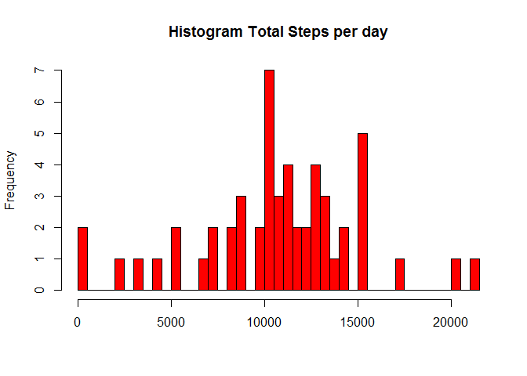

# Reproducible Research: Peer Assessment 1


## Loading and preprocessing the data


```r
Steps <- read.csv("activity.csv")
head(Steps)
```

```
##   steps       date interval
## 1    NA 2012-10-01        0
## 2    NA 2012-10-01        5
## 3    NA 2012-10-01       10
## 4    NA 2012-10-01       15
## 5    NA 2012-10-01       20
## 6    NA 2012-10-01       25
```

```r
str(Steps)
```

```
## 'data.frame':	17568 obs. of  3 variables:
##  $ steps   : int  NA NA NA NA NA NA NA NA NA NA ...
##  $ date    : Factor w/ 61 levels "2012-10-01","2012-10-02",..: 1 1 1 1 1 1 1 1 1 1 ...
##  $ interval: int  0 5 10 15 20 25 30 35 40 45 ...
```

```r
dataTotal <- aggregate(. ~ date, data=Steps, sum)
lines <- nrow(dataTotal)
meanSteps <- mean(dataTotal$steps)
medianSteps <- median(dataTotal$steps)
```

## What is mean total number of steps taken per day?

```r
hist(dataTotal$steps, breaks = lines, col = "red", main = "Histogram Total Steps per day", xlab = "" )
```

 

```r
mean(dataTotal$steps)
```

```
## [1] 10766.19
```

```r
median(dataTotal$steps)
```

```
## [1] 10765
```


## What is the average daily activity pattern?


## Imputing missing values


## Are there differences in activity patterns between weekdays and weekends?
