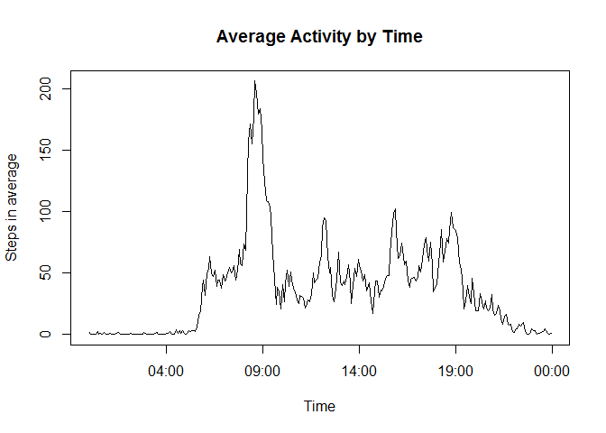

# Reproducible Research: Peer Assessment 1


## Loading and preprocessing the data


```r
library(stringr)
## File with all data
Steps <- read.csv("activity.csv")

## Agregatted by date
dataTotal <- aggregate(. ~ date, data=Steps, sum)

## total number of days with data to use on hist
lines <- nrow(dataTotal)
```

## What is mean total number of steps taken per day?

```r
## Asked histogram of steps per day
hist(dataTotal$steps, breaks = lines, col = "red", main = "Histogram Total Steps per day", xlab = "" )
```

 

```r
## mean of the steps per day
mean(dataTotal$steps)
```

```
## [1] 10766.19
```

```r
## median of the steps per day
median(dataTotal$steps)
```

```
## [1] 10765
```


## What is the average daily activity pattern?

```r
## Removes NA to not interfere in mean
StepsnoNA <- na.omit(Steps)

## take the mean of intervals
dataMean <- aggregate(. ~ interval, data=StepsnoNA, mean)

## convert interval to POSIXct
dataMean$interval <- as.POSIXct(str_pad(dataMean$interval,4,pad="0"), format="%H%M")

## Asked histogram of steps per day
plot(dataMean$interval,dataMean$steps, type = "l", main = "Average Activity by Time", xlab = "Time", ylab="Steps in average" )
```

 


## Imputing missing values


## Are there differences in activity patterns between weekdays and weekends?
